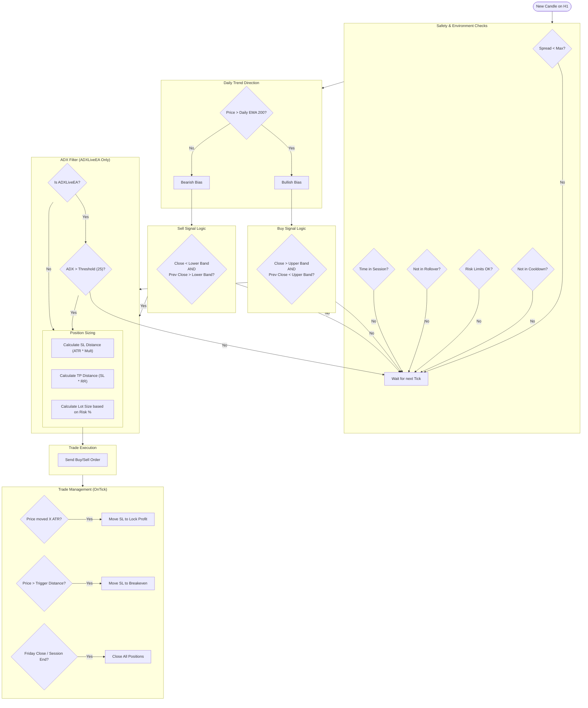

# Expert Advisor Strategy Visualization

This document provides a visual representation of the logic used in the MT5 Expert Advisors (`ADXLiveEA`, `LiveEA`, `BootcampEA`).

## Core Strategy: Keltner Channel Breakout

All EAs share the same core logic based on Keltner Channel breakouts aligned with the daily trend. The main difference lies in the **ADX Filter** used in `ADXLiveEA` for higher quality setups.

## Key Parameters

| Parameter | Description | Typical Value |
|-----------|-------------|---------------|
| **Timeframe** | Entry Chart Timeframe | H1 |
| **Daily EMA** | Trend Filter Period | 200 |
| **Keltner Period** | Channel Period | 12 |
| **Keltner Mult** | Channel Width Multiplier | 1.0 - 1.4 |
| **ATR Period** | Volatility Measure | 14 |
| **Risk %** | Risk per trade | 2.0% - 2.5% |
| **ADX Threshold** | Trend Strength (ADXLiveEA only) | 25 |

## Logic Summary

1.  **Trend Filter**: We only trade in the direction of the long-term trend (Daily EMA 200).
2.  **Entry Signal**: We enter when price "explodes" out of the Keltner Channel (Breakout).
3.  **Validation**:
    *   **LiveEA / BootcampEA**: Takes the trade immediately if safety checks pass.
    *   **ADXLiveEA**: Waits for ADX > 25 to confirm a strong trend before entering.
4.  **Exit**:
    *   **Stop Loss**: Dynamic based on ATR (Volatility).
    *   **Take Profit**: Fixed Risk:Reward ratio (e.g., 1:2).
    *   **Trailing Stop**: Locks in profits as price moves in our favor.
